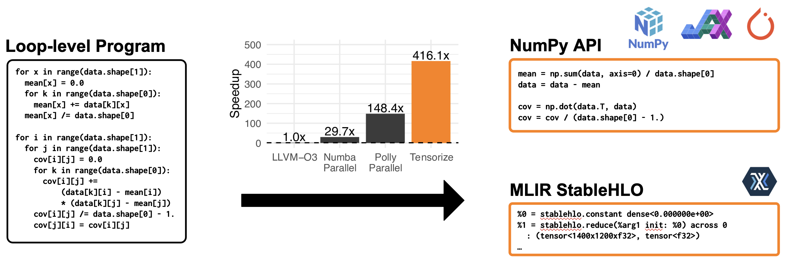

# Tensorize: Lifting Loop-Level Programs to Tensor DSLs



## Why Tensorize?

### The Problem

Tensor Domain-Specific Languages (DSLs) such as NumPy, JAX, and StableHLO deliver high performance through compiler optimizations and hardware acceleration. However, leveraging these benefits requires rewriting existing applications in these DSLs, which is time-consuming and error-prone.

### The Solution

Tensorize is an MLIR-based compiler that automatically lifts loop-level code from legacy codebases to high-level Tensor DSLs using program synthesis. It constructs a symbolic trace of the loop-level program as a specification and synthesizes a functionally equivalent Tensor DSL program. The approach employs Tensor DSL sketching and recursive symbolic simplification, ensuring the correctness of the compilationtransformation

### Key Features

✅ Zero Manual Effort – Automatically synthesizes Tensor DSL programs from loop-level programs.

🚀 Scalable – More scalable than prior program synthesis approaches (see paper for benchmarks).

🔍 Correct-by-Construction – Ensures symbolic equivalence through algebraic sketching and solving.

🌐 MLIR-Based – Leverages MLIR’s ecosystem and integrates seamlessly into compiler workflows.

🔧 Hardware Retargetability – Enables execution on CPUs, GPUs, and TPUs via Tensor DSLs.

## Getting started

### Installation
```
# Option 1: Local build
./build_tools/build_dependencies.sh  # Builds MLIR, StableHLO, ...
./build_tools/build.sh               # Builds Tensorize

# Option 2: Docker (recommended for reproducibility)
./run_all.sh
```

### Basic Usage
```
python tensorize/main.py --help
  --program   Specifies the MLIR file of the source
              program to synthesize.
  --synth_out Specifies the output file for the
              synthesized program.
  --target    Defines the target DSL.
              (default: numpy)
  ...
```

### Basic Example
```
python tensorize/main.py --program original.mlir
                         --synth_out synth.py
                         --target numpy
```

## Technical Deep Dive

Tensorize operates in three key stages:

1. **Symbolic Tracing:**
Extracts semantics of legacy code via symbolic tracing.

2. **Sketch Generation:**
Generates sketches Tensor DSL sketches.

3. **Algebraic Symbolic Synthesis:**
Rapidly simplifies symbolic trace using Tensor DSL sketches, by using a symbolic algebra solver.

More details can be found in our paper: [https://dl.acm.org/doi/10.1145/3696443.3708956](https://dl.acm.org/doi/10.1145/3696443.3708956).

## Cite Our Work

```
@inproceedings{tensorize2025,
  title={Tensorize: Fast Synthesis of Tensor Programs from Legacy Code using Symbolic Tracing, Sketching and Solving},
  author={Brauckmann, Alexander and Jaulmes, Luc and de Souza Magalh{\~a}es, Jos{\'e} W and Polgreen, Elizabeth and O’Boyle, Michael FP},
  booktitle={Proceedings of the 23rd ACM/IEEE International Symposium on Code Generation and Optimization},
  pages={15--30},
  year={2025}
}
```